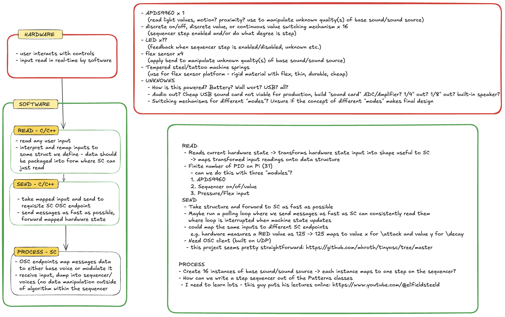

# mort-garson
Music for Advertising

A non-traditional step sequencer

Run program in a straight line - Hardware/input -> read/map -> send message -> process message/generate sound

Lectures: https://www.youtube.com/@elifieldsteel

Flex Sensor Data sheet: https://cdn-shop.adafruit.com/datasheets/SpectraFlex2inch.pdf

OSC Client in C: https://github.com/mhroth/tinyosc
 - This could be relevant/have done some of the hard work for us

Unrelated project that streams SC output over the World Wide Web: https://github.com/khilnani/supercollider.web/tree/master

Hardware - 
 - Raspberry pi 4 8gb (TODO: in this section, we need more granular and specific specs to replicate this if we make more than one)
 - needs parts list/manifest/datasheets
 - SOUND CARD: we can't just rely on this PiShop peripheral, we might need to build our own

Sofware -
 - PI os version (we should get a few more pis and build these totally headlessly with latest bookworm)

## SCRATCH PROJECTS

We're still figuring things out, and there's a ton of small scratch directories here with little python apps. Add a readme to yours if it's relevant

### drone_mode

Contains a small GUI to emulate APDS light sensor. I watched some dude's youtube about TKinter and old boy said something like "state gets all weird and
shit when you use TKinter so if you want to make it easy on yourself just write your GUI in one big class" and so I did. Pearson - the `self` keyword is interesting here - 
it is a sort of variable that will allow a given class to reference itself/its own methods/state/variables. Writing it this way basically allows us to encapsulate all our
code/features into one entity without it getting too squirrley with global variables/closures/functions etc. All values/methods are a part of this class and they all have access to one another.

1. If you haven't run this: 
  1. In a terminal, navigate into `/drone_mode`
  1. Run `python3 -m venv venv` to create a virtual environment named `venv` (assuming you have python3 installed on your machine, install it ()[])
  1. You should see your terminal prefixed with a little `(venv)` if this works, this is how mine looks when I have it running `(venv) venvgonzalogazpacho@Gonzalos-MacBook-Pro drone_mode %`
  1. Then run `pip3 install -r requirements.txt` - this basically tells pip to install your dependencies in the `venv`, and it reads them from the `requirements.txt`
  1. Finally, run the GUI with `python3 drone_mode.py`
  1. When you're done, run `^C + C` to quit (`control + C` on a Mac and probably linux, no fucking clue about windows...)
1. If you HAVE run this before and installed your dependencies:
  1. Just run `source venv/bin/activate` - if you named your virtual environment something else that's stupid now you can't just copy paste my commands
  1. Run the GUI with `python3 drone_mode.py`
  1. Quit the GUI when you're done
1. Open `drone_mode.py` in Supercollider, select all and run
1. In the python GUI - when checkbox is checked, the synths are running. The converse is also true.
1. Adjust the sliders to adjust the awful sounds