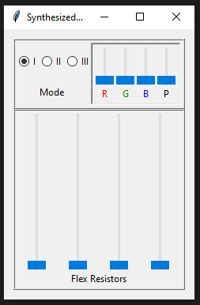

# Synthesized Synthesizer Interface

Simple python interface that should resemble our desired hardware interface and have a quick iteration time.

It uses the [Tkinter package](https://docs.python.org/3/library/tkinter.html) included in the standard Python libraries.

## Interface Mock Up

Based on our discussions, I created a simple mock up of what our interface could look like.

## Interface Implementation

The mock up translated to the following implementation:

