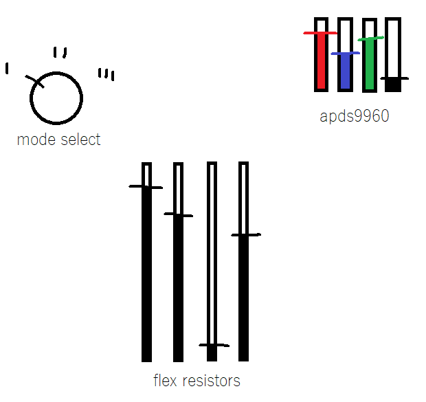
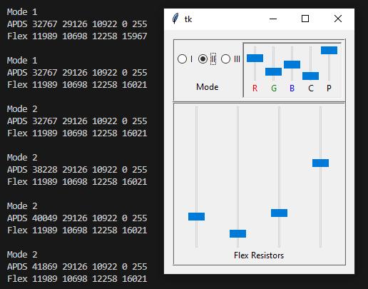

# Synthesized Synthesizer Interface

Simple python interface that should resemble our desired hardware interface and have a quick iteration time.

It uses the [Tkinter package](https://docs.python.org/3/library/tkinter.html) included in the standard Python libraries.

## Interface Mock Up

Based on our discussions, I created a simple mock up of what our interface could look like.

## Interface Implementation

The mock up translated to the following implementation:

### What's next?

This paints a fairly straightforward picture of simulating our desired hardware inputs with a Python GUI.

The GUI is set up with some thought toward swapping over to metal hardware down the line, such as the various scale values matching up with what we can expect to get from our various hardware readings.

It also hopefully demonstrates that the code could be used largely as-is once we start implementing the hardware reading stuff. The abstract [InputBase](./package/inputs/input_base.py) class defines a simple contract for communicating between the main program and whatever interface we end up using. A real example of that is the [InputSimulated](./package/inputs/input_simulated.py) class, which creates a GUI and sends back values from there. Using that pattern, we can implement the stubbed [InputHardware](./package/inputs/input_hardware.py) class once we know what hardware we want to use and have it all hooked up.
